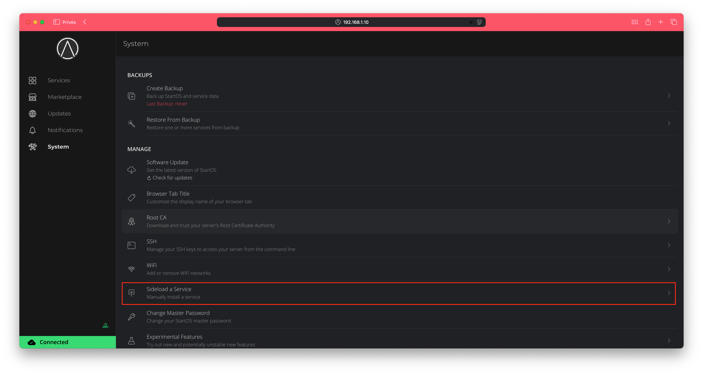
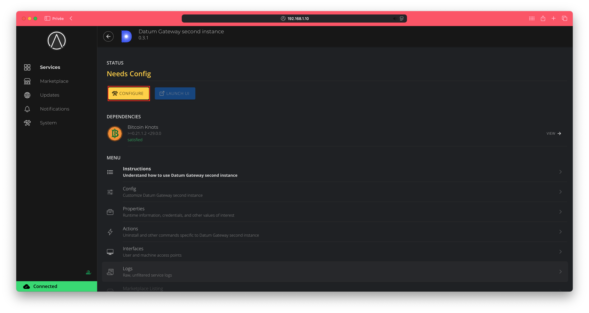
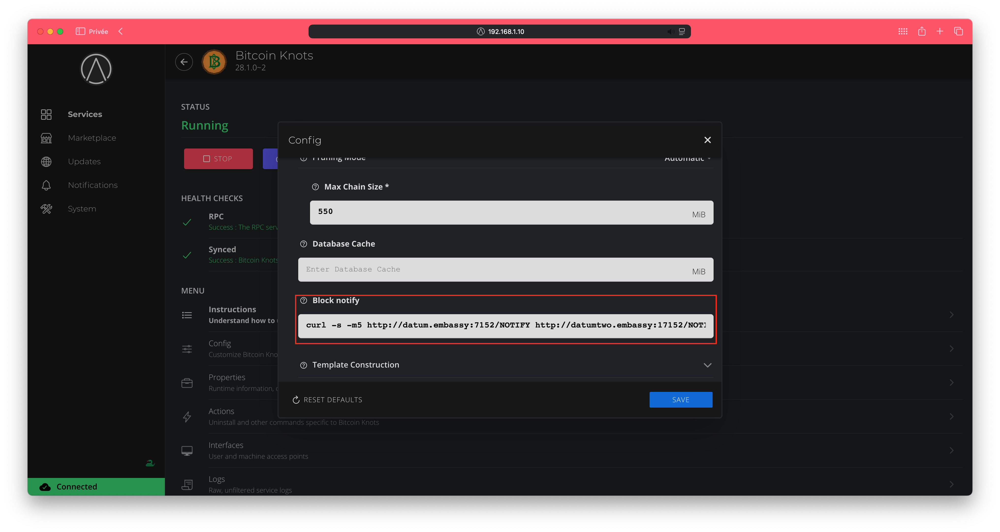
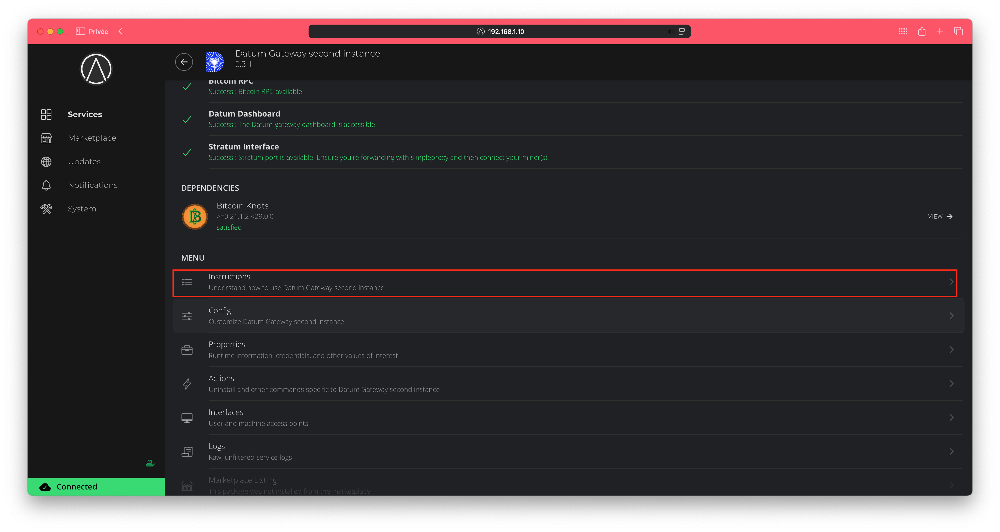

How to setup a second datum instance on [Start9](https://start9.com).
===

**Follow this guide only if you have already a datum instance running!**

1. Download the [special datum package](https://github.com/Retropex/datum-gateway-startos/releases/tag/v0.3.1-SI).
2. Login to your start9 server.
3. Go to system -> sideload a service:



4. Upload the package downloaded previously and wait for the install to finish.
5. Click on configure and enter your desired configuration and you Bitcoin address:



6. Click on start to start datum.
7. Now go to the settings of your Bitcoin Knots package.
8. Under the "advanced" section there is a "block notify" field, replace it's content by this one:

```bash
curl -s -m5 http://datum.embassy:7152/NOTIFY http://datumtwo.embassy:17152/NOTIFY
```



9. Save and click on start to start Bitcoin Knots again.
10. If your miners do not support mDNS then follow the simple proxy instruction on the instruction tab:



Done! you now have two datum instance.
