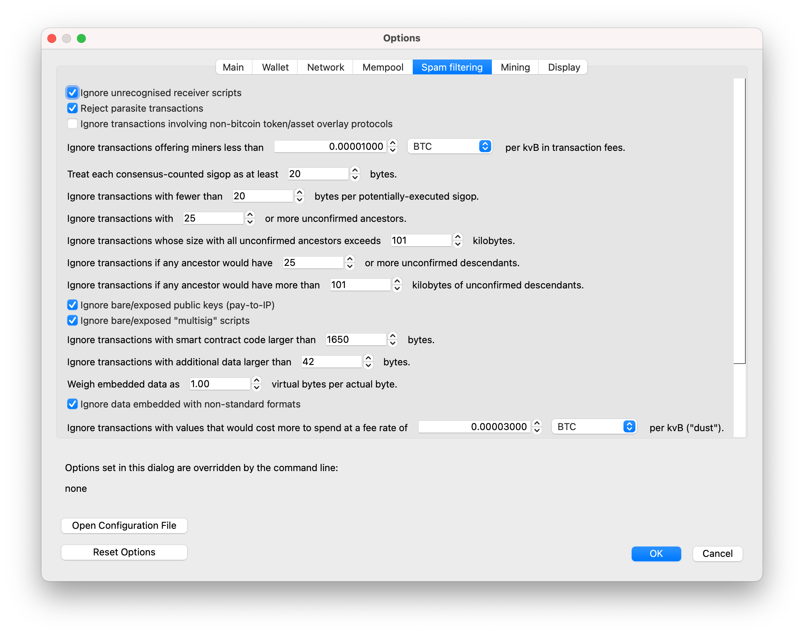

How to disable datacarrier on Bitcoin Knots GUI.
=============

1. Open the Bitcoin Knots app.
2. Go to the settings.
3. Click on `Spam filtering`.

4. lower the value of `Ignore transactions with additional data larger than` to `0`

5. click on "OK" and restart Bitcoin Knots