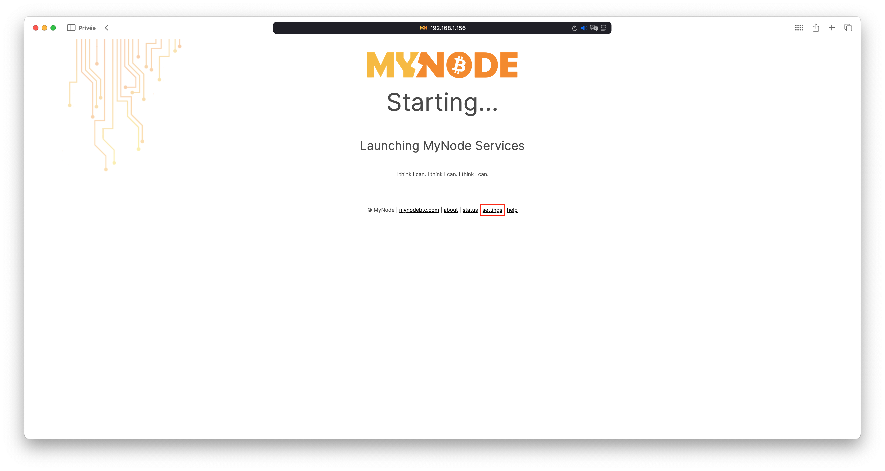
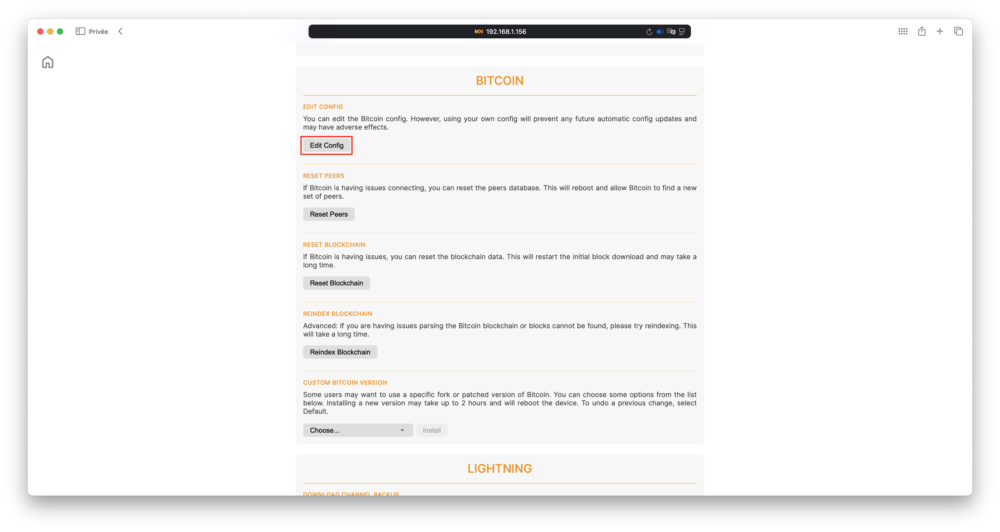
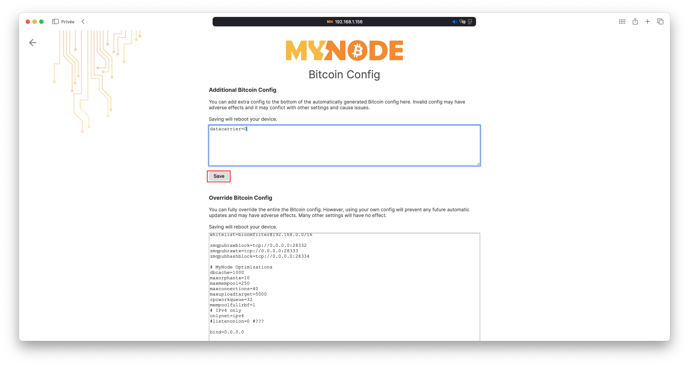

How to disable datacarrier on [Mynode](https://mynodebtc.com).
===

1. Login on your mynode device.
2. Go to the bottom of the page and click on `settings`:

3. Scroll to the Bitcoin section and click on `edit config`:

4. On the section "Additional Bitcoin Config" add `datacarrier=0` and click on save:

Mynode will automatically restart and the change will be done!