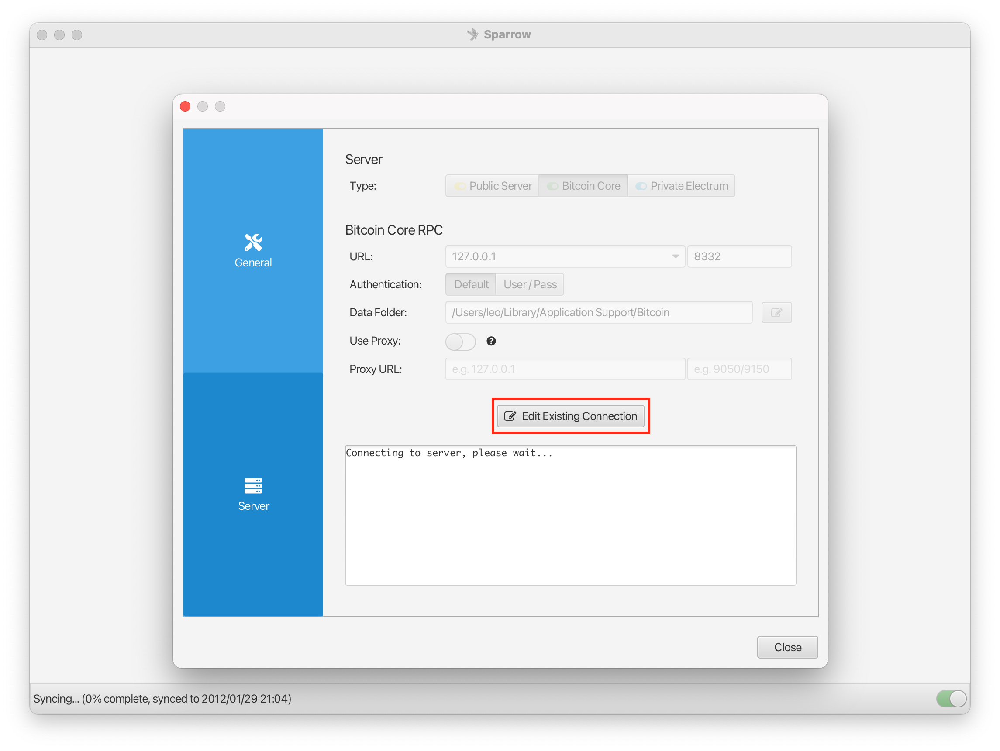

How to install Knots and connect sparrow to it.
=============

1. [Download Bitcoin Knots](https://bitcoinknots.org/#download).
2. Open the Bitcoin Knots app.
3. Go to the option and enable `RPC server`.

4. Close and open again Knots to apply the changes.
5. [Download Sparrow](https://sparrowwallet.com/download/).
6. Go to the settings then server.
7. Click on edit existing connection.

8. Select Bitcoin Core (don't worry you are not using Core).
9. Prefilled value should be fine!
10. Click on test connection.

You should see a succeful message:

You are now using your own node to verify your transactions! 🎉
