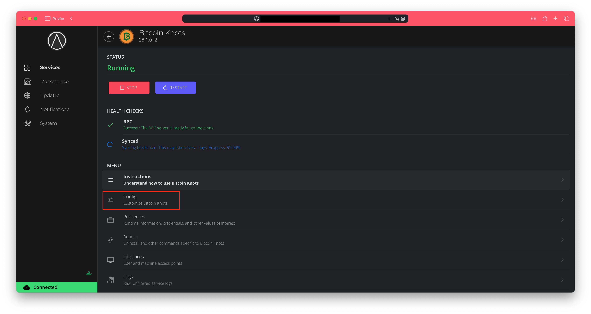
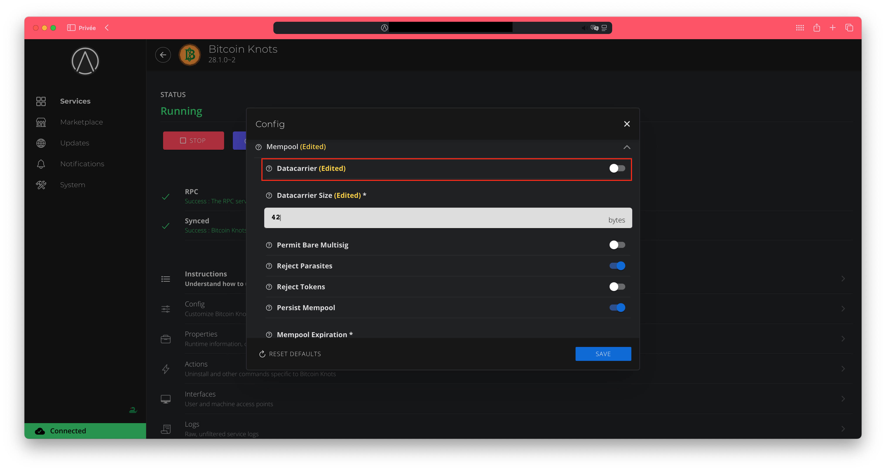

How to disable datacarrier on [Start9](https://start9.com).
===

1. Login to your start9 server.
2. Click on `Bitcoin Knots` -> `Config`:

3. Under the `Mempool` section uncheck `Datacarrier`:

4. Click on the `Save` button:

Bitcoin Knots will automatically restart and the change will be done!