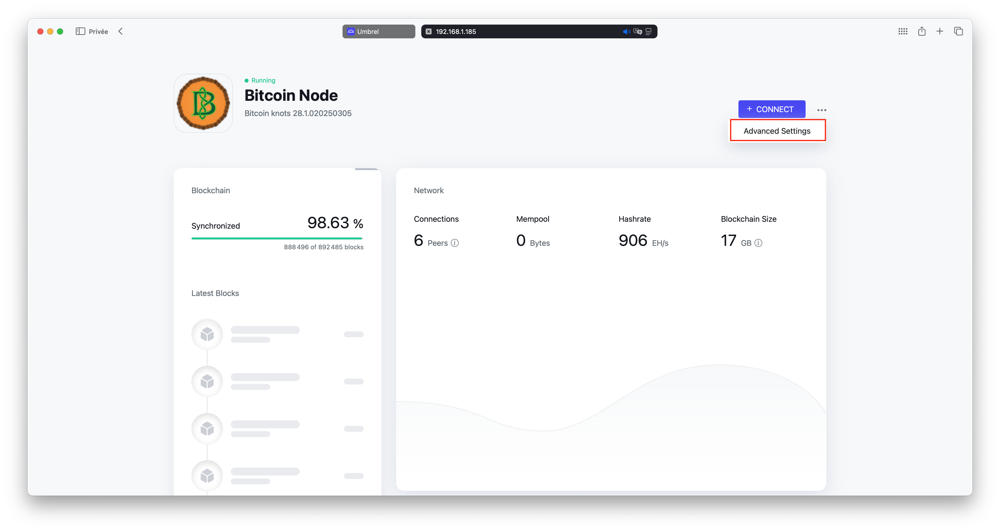

How to disable datacarrier on Umbrel.
===

1. Login to your umbrel
2. Click on Bitcoin Knots then the three dots and on `advanced settings`.

3. Click on the optimisation section.

4. Uncheck the `Relay transaction with embedded data` option.

5. Click on `save and restart bitcoin node`.

Bitcoin Knots will automatically restart and the change will be done!